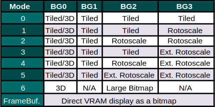
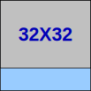
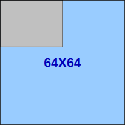

# LibNDS Quick Docs

<Callout type="note">
  This documentation is a simplified version adapted to the content of EPFL's
  [EE-310
  Course](https://edu.epfl.ch/coursebook/en/microprogrammed-embedded-systems-EE-310).
  For more details or advanced documentation, check out the official [LibNDS
  Documentation](https://libnds.devkitpro.org/).
</Callout>

## I/O & Peripheral Devices


Two 32-bit ARM cores manage the I/O and peripherals on the NDS, each connected to different peripherals. There are two basic mechanisms for I/O subystem syncronization : programmed I/O with active waiting response, and I/O interrupts.

### Interrupts

Initialize interrupts subsystem

```c
void irqInit();
```

This is the usual way to initialize peripherals (except when using sound).

<Callout type="warning">
  This disables VBLANK interrupts, that are activated by default.
</Callout>

Specify the handler to use for the given interrupt

```c
void irqSet(IRQ_MASK irq, VoidFn handler)
```

Remove the handler associated with the interrupt

```c
void irqClear(IRQ_MASK irq)
```

Allow the given interrupt to occur

```c
void irqEnable(uint32 irq)
```

Prevent the given interrupt from occurring

```c
void irqDisable(uint32 irq)
```

### Timers

Libnds provides several macros to deal with timers:

**Timer CR**

Return a de-referenced pointer to the timer control register x (0 to 3):

```c
TIMER_CR(x) // or TIMERx_CR
```

Enable the timer:

```c
TIMER_ENABLE
```

Timer will count at (33.514 / VALUE) MHz, with VALUE = 1, 64, 256, or 1024:

```c
TIMER_DIV_VALUE
```

Request interrupt on overflow:

```c
TIMER_IRQ_REQ
```

**Timer Data**

Return a de-referenced pointer to the data register for timer x (0 to 3):

```c
TIMER_DATA(x) // or TIMERx_DATA
```

Set up the register value to start and overflow each 1/freq second, with VALUE = 64, 256, or 1024 (if no VALUE specified, 1):

```c
TIMER_FREQ[_VALUE](freq)
```

To choose the divider to use depending on the actual timer frequency we want, we ideally use the smallest possible value in the table below that satisfies our constraints.

| Divider | Max Time/Cycle          | Min Freq |
| ------- | ----------------------- | -------- |
| 1       | 1.955 ms (most precise) | 510 Hz   |
| 64      | 125.151 ms              | 8 Hz     |
| 256     | 500.603 ms              | 2 Hz     |
| 1024    | 2.002 s (least precise) | 0.5 Hz   |

<Callout type="example">
```c
int frequency = 20;
TIMER0_CR = TIMER_DIV_64 | TIMER_ENABLE | TIMER_IRQ_REQ;
TIMER0_DATA = TIMER_FREQ_64(frequency);
```

To use interrupts:

```c
irqSet(IRQ_TIMER0, timer_isr);
irqEnable(IRQ_TIMER0);
```

</Callout>

## Graphics


### Configurations

#### Power Manager

Control register for powering up I/O NDS devices: `REG_POWERCNT`


LCD and engines **activated by default** during the boot-up process. This means we usually won't need to manually set configurations for the power manager.

It is possible to enable / disable them manually to save power at run-time.

<Callout type="example">
Activation :

```c
REG_POWERCNT = POWER_LCD | POWER_2D_A;
```

Deactivation :

```c
REG_POWERCNT &= ~(POWER_LCD) & ~(POWER_2D_A);
```

</Callout>

#### Video Memory

Control register for each bank to select and activate: `VRAM_?_CR`


The VRAM is divided into 9 banks of different sizes:

|          |        |
| -------- | ------ |
| `VRAM_A` | 128KiB |
| `VRAM_B` | 128KiB |
| `VRAM_C` | 128KiB |
| `VRAM_D` | 128KiB |
| `VRAM_E` | 64KiB  |
| `VRAM_F` | 16KiB  |
| `VRAM_G` | 16KiB  |
| `VRAM_H` | 32KiB  |
| `VRAM_I` | 16KiB  |

See [VRAM Management](#vram-management) for more information on how to organise storage in memory of different data.

Activate bank A and map it to the framebuffer:

```c
VRAM_A_CR = VRAM_ENABLE | VRAM_A_LCD;
```

Activate bank A and map it to the main background:

```c
VRAM_A_CR = VRAM_ENABLE | VRAM_A_MAIN_BG;
```

We can also use predefined functions:

```c
vramSetBankA(VRAM_A_LCD);
```

#### Graphical Engine

Display register to control the mode and active backgrounds: `REG_DISPCNT`


Choosing the configurations for the graphical engine is done according to the existing [screen modes](#screen--modes) for each engine.

Use `REG_DISPCNT` to choose configurations for the main graphical engine (the top screen of the NDS) and `REG_DISPCNT_SUB` to choose the configurations for the secondary graphical engine (the bottom screen of the NDS).

<Callout type="example">
Activate mode 0 and background 1 :

```c
REG_DISPCNT = MODE_0_2D | DISPLAY_BG1_ACTIVE;
```

</Callout>

#### Additional Configuration

In **Rotoscale** and **Tiled** mode, some additional configurations are required. We will need to configure each active background, initialize palettes if we are using 8 bits mode, and optionally adjust the affine transformation matrix for each background.

Check out the corresponding sections for more information on these configurations.

### Pixels & Color

Each pixel has an RGB (Red-Green-Blue) representation of 16 bits

- 5 bits for the intensity of each colour (0: none, 31: maximum value)
- 1 bit for transparency (0: pixel is transparent, 1: pixel is opaque)

Some reference colours :

|        |                   |
| ------ | ----------------- |
| Red    | `RGB15(31,0,0)`   |
| Green  | `RGB15(0,31,0)`   |
| Blue   | `RGB15(0,0,31)`   |
| Yellow | `RGB15(31,31,0)`  |
| Black  | `RGB15(0,0,0)`    |
| White  | `RGB15(31,31,31)` |

<Callout type="example">
With transparency bit :

```c
static uint16 shape_color = ARGB16(1, 31, 0, 0);
```

Without Transparency bit :

```c
static uint16 shape_color = RGB15(31, 0, 0);
```

</Callout>

### Palettes

A palette is a color collection used to reduce index sizes needed to represent pixel colors. Instead of colors being 16 bits per pixel (ARGB16), we use only 8 bits per pixel. To do this, we predefine 256 colors (defined in ARGB16 and stored in a collection), and then use the index of these colors to set pixel colors. Since we have 256 available colors in our defined palette, this means each index is only 8 bits.

Palettes are stored in the palette RAM, which stores either one 256 color palette, or 16 palettes of 16 colors each.

With 256 colors the color indexes go from 0x00 to 0xFF. When using 16 palettes of 16 colors, the first digit (0x0 to 0xF) is the palette and the second (0x0 to 0xF) is the color.

Index 0 of a palette represents transparency: a pixel set at this color will display opaque pixels behind it from other backgrounds if there are any. If there is no opaque pixel behind it, it will appear as the actual RGB color stored at index 0.


<Callout type="example">
Initializing a palette :

```c
uint 16* myPalette = BG_PALETTE;
int i;
for (i=0; i < 32 ; i++) {
    myPalette[i] = ARGB16(1,0, 0, i);
}
```

</Callout>

### Screen & Modes

Each of the screens have 49152 pixels: 192 rows of 256 points each. The screen draws pixels sequentially from left to right and up to down (the origin is always top left).

Two interrupts occure from the screen drawing :

|              |                                                   |
| ------------ | ------------------------------------------------- |
| `IRQ_HBLANK` | Horizontal blank : after each line is drawn       |
| `IRQ_VBLANK` | Vertical blank : after all of the lines are drawn |

The bitmap content to draw is changed after a vertical blank, before the start of the next redraw.

Each engine has four backgrounds (or layers): BG0, BG1, BG2 and BG3. Final view on the screen is their combination based on the graphic mode.

Each 2D engine has different sets of four possible modes:

- Tiled
- Rotoscale
- Extended Rotoscale
- Framebuffer

There are two 2D engines on the NDS

- Main: can display both video memory content or bitmaps of 256 colours. Also it can use the proprietary 3D graphics engine for backgrounds.
- Sub: secondary display that can only use the video memory content.

Main engine modes



Sub engine modes


### Backgrounds

Up to four superposed backgrounds can be used at a time, and each one can be used in a different mode. BG0 is the topmost background and BG4 the furthest.

The background memory is divided in 32 blocks of 16KB.


To configure the background controller in a **bitmap / framebuffer** mode, we indicate the slot to use in the dedicated memory for backgrounds using `BG_BMP_BASE(x)` (or `BG_BMP_BASE_SUB(x)` for the secondary display) and indicate background size and format (ex: `BgSize_B8_256x256` - palette format & 256x256 pixels).

To configure the background controller in a **tiled** mode, we specify the tile grid size (ex: `BG_32x32`), color amount (ex: `BG_COLOR_256`), map base (ex: `BG_MAP_BASE(x)`) and tile base (ex: `BG_TILE_BASE(x)`).


<Callout type="example">
Configuring background controller in a bitmap / framebuffer mode:

```c
BGCTRL[2] = BG_BMP_BASE(0) | BgSize_B16_256x256;
```

Configuring background controller for secondary display:

```c
BGCTRL_SUB[2] = BG_BMP_BASE(0) | BgSize_B8_256x256;
```

Configuring background controller in tiled mode:

```c
BGCTRL[0] = BG_32x32 | BG_COLOR_256 | BG_MAP_BASE(0) | BG_TILE_BASE(1);
```

</Callout>

Background X can be shifted (scroll) using write-only registers `REG_BGXHOFS` and `REG_BGXVOFS` (where X is the number of the background).

### Framebuffer Mode

In the Framebuffer mode, the screen is directly mapped to a portion of memory (192 x 256 bitmap). Writing data to this memory directly results in data represented onto the screen.

There are four different framebuffers, that are each linked to one of the four 128KiB VRAM banks.

|       |          |
| ----- | -------- |
| `FB0` | `VRAM_A` |
| `FB1` | `VRAM_B` |
| `FB2` | `VRAM_C` |
| `FB3` | `VRAM_D` |

The [pixel format](#pixels--color) is always `RGB15` in the framebuffer mode : pixels are always opaque, so the transparency bit is not used.

We can also use double buffering : One buffer is being read to write on the screen, while another one is being written in memory, and they are exchanged at the VBLANK interrupt.

<Callout type="example">
Configuration when using framebuffer `FB0`

```c
REG_DISPCNT = MODE_FB0;
VRAM_A_CR = VRAM_ENABLE | VRAM_A_LCD;
```

</Callout>

### Rotoscale Mode

In the rotoscale mode, the memory is not directly mapped onto the screen. We have a couple more functionnalities.

The rotoscale mode is called this way because it uses a transformation matrix, which allows us to rotate, scale an displace our original backgrounds.

The rotoscale mode also uses palettes: instead of each pixel being 16 bits, we only use 8 bits for each pixel.

The configuration for this mode has a couple more steps: on top of the usual Power Manager, VRAM and Graphical Engines configurations, we also need to configure each background, and the palette(s) when using 8 bit mode. We also need to adjust the transformation matrix for each background if we are using extended rotoscale.

<Callout type="note">
Use extended rotoscale rather than rotoscale by default. Don't forget to set the transformation matrix to be identity if you don't want to use the rotation, as it still needs to be defined.

</Callout>

#### Transformation Matrix

Rotoscale mode allows us to apply a rotation and scaling operation on the different backgrounds using a transformation matrix.

The transformation matrix is configured using `bgTransform`.

Although the fields are declared as signed integers, they use fixed-point numbers, with 8 bits for decimal part. So to write a number `x` we must actually use `x * 256`

```c
typedef struct {
    s16 hdx;
    s16 vdx;
    s16 hdy;
    s16 vdy;
    s32 dx;
    s32 dy;
} bg_transform;
```

For each background, we configure the transformation matrix like this (n is the nackground number):

```c
bgTransform[n]->hdx=256;
bgTransform[n]->vdx= 0;
bgTransform[n]->hdy= 0;
bgTransform[n]->vdy= 256;
bgTransform[n]->dx= 0;
bgTransform[n]->dy= 0;
```

Here are some well know transformations:

|                                                  |                                       |
| ------------------------------------------------ | ------------------------------------- |
|             | Transformation matrix format          |
|         | Identity                              |
|      | Vertical Mirror                       |
|       | Horizontal Mirror                     |
|  | Vertical & Horizontal Mirror          |
|      | Vertical Shrink (divide height by 2)  |
|       | Horizontal Shrink (divide width by 2) |
|  | Clockwise Rotation by y (in radians)  |

<Callout type="note">
`hdx` and `vdx` were previously `xdx` and `ydx`. Be careful which one you use, depending on your version of LibNDS.

</Callout>

### Tiled Mode

In the tiled mode, the backgrounds are composed of smaller blocks. The minimum unit used to create tiled backgrounds are called tiles (or text), and are blocks of 8x8 pixels.

Backgrounds are maps of tiles : they reference tiles using their index. The tile collection can contain up to 1024 tiles, meaning their index is 10 bits.

Palettes are also used for pixels in tiled mode. Either one 256 color palette or 16 palettes of 16 colors are used.

#### Tiles

Tiles are essentially 8x8 matrix of color indexes from a palette. These color indexes are either 8 bits (256 color palette) or 4 bits (16 color palette).

Tiles are stored from the base address `BG_TILE_RAM(x)`. Tile base addresses are multiples of 16KiB and the maximum size is 256KiB.

We use `BG_TILE_BASE(x)` to configure the background control register and `BG_TILE_RAM(x)` (or `BG_TILE_RAM_SUB(x)`) to access the tile set or modify it.

`x` goes from 0 to 15 (there are 16 base addresses for tiles). This is due to the fact that 4 bits are used to store tile base displacement in the background control register.


#### Maps

A map of tiles can be larger than the screen, and the visible area can then be adjusted with a scroll effect. The screen has size 32x34 tiles (256x192 pixels).

There are four possible map sizes on the NDS:

   

Each tile in a map is represented with 16 bits:


The palette is specified if 16 palettes of 16 colors are used. This way tiles can use 4 bit colors.

To set the tiles data in map we can use `TILE_PALETTE` for the palette, and `TILE_FLIP_H` and `TILE_FLIP_V` for the flip bits.

Maps are stored from the base address `BG_MAP_RAM(x)`. Map base addresses are multiples of 2KiB and the maximum size is 64KiB. The most used size of map is 32x32 tiles, which is exactly 2KiB (2B per tile), but other map sizes may use up more than one slot in RAM.

We use `BG_MAP_BASE(x)` to configure the background control register and `BG_MAP_RAM(x)` (or `BG_MAP_RAM_SUB(x)`) to access the tile set or modify it.

`x` goes from 0 to 31 (there are 32 base addresses for maps). This is due to the fact that 5 bits are used to store tile base displacement in the background control register.


### Sprites

Sprites are small graphic objects that can be rendered on top of the backgrounds and provide extended features.

Different sizes are possible (8x8, 16x16, 32x32, 64x64, 16x8, 32x8, 32x16, 64x32, 8x32, 16x32).

They can be rendered in any position, on or outside of the screen. They can be rotated, scaled or flipped, and can be made in different modes (bitmap, tiled...).

The amount of sprites is fixed to 128 and they are hidden by default.

A special mode has to be configured in a VRAM mode: this bank cannot be used for anything else (e.g.: for backgrounds). A sprite is associated to a graphic stored in memory and several sprites can be associated to the same graphic (we can have several sprites with a single graphic loaded in memory). They use a special palette (different from the one used for backgrounds) and can use extended palettes

<Callout type="example">
Sprite Configuration:

```c
VRAM_B_CR = VRAM_ENABLE | VRAM_B_MAIN_SPRITE;

// Initialize sprite manager and the engine
oamInit(&oamMain, SpriteMapping_1D_32, false);

// Allocate space for the graphic to show in the sprite
gfx = oamAllocateGfx(&oamMain, SpriteSize_32x32, SpriteColorFormat_256Color);

// Copy data for th graphic
swiCopy(imagePal, SPRITE_PALETTE, imagePalLen / 2);
swiCopy(imageTiles, gfx, imageTilesLen);

```

Simple Sprite Usage:

```c
//Position
int x = 0, y = 0, keys;

while (1) {
    //Read held keys
    scanKeys() ;
    keys = keysHeld();

    //Modify position of the sprite accordingly
    if((keys & KEY_RIGHT) &&
        (x < (SCREEN_WIDTH - SPRITE_WIDTH)))
        x+=2
    if((keys & KEF DOWN) &&
        (y < (SCREEN HEIGHT - SPRITE_HEIGHT)))
        y+=2;
    if((keys & KEF LEFT) && (x > 0))
        x-=2;
    if((keys & KEF UP) && (y > 0))
        y-=2;

    oamSet (&oaMain ,      // oam handler
        0,                 // Number of sprite
        x, y,              // Coordinates (top left)
        0,                 // Priority
        0,                 // Palette to use
        SpriteSize_32x32,           // Sprite size
        SpriteColorFormat_256Color, // Color format
        gfx,          // Loaded graphic to display
        -1,           // Affine rotation (-1 none)
        false,        // Double size if rotating
        false,        // Hide this sprite
        false, false, // Horizontal or vertical flip
        false);       // Mosaic
    swiWaitForVBlank();

    //Update the sprites
    oamUpdate(&oamMain);}
```

</Callout>

### Grit

Grit (GBA Raster Image Transmogrifier) is a tool that transforms images from PNG format into an NDS readable format.

It generates assembly code and a C header file (declaration of palettes, maps and graphic data).

Conversion is automated using a few rules included in the Makefile of the project and a configuration file (extension .grit). The configuration file simply contains some parameter flags. It must have the same name as the image.

- Place image to transform (“myImage.png”) and configuration file ( “myImage.grit”) in the project folder data
- During the compilation process, grit will be called and the output files will be placed automatically in the temporary building folder build

The grit configuration file may contain the following parameters :

|             |                                        |                  |
| ----------- | -------------------------------------- | ---------------- |
| \-g \| -g!  | Include or do not include graphic data | Always Include!  |
| \-gb \| -gt | Generate Bitmap or Tiles               | Depends on Mode  |
| \-p \| -p!  | Include or do not include the palette  | Usually Generate |
| \-m \| -m!  | Include or do not include the map      | For Tiled Mode   |
| \-pnX       | Restrict the palette size to X colors  |                  |
| \-gBX       | Sets the pixel size to X bits          | X = 8 or 16      |
| \-gTC       | Sets the color C to transparent        | C = hex          |

Grit can be used from the terminal like this :

```bash
grit myImage.png -g -gB16
```

For more parameters use `grit --help{:bash}`.

<Callout type="note">
For tiles, image sizes must be multiples of 8.

Color (for setting transparency color) should be a 16bit BGR color or 24bit RGB color in hex.

</Callout>

### VRAM Management

Many different types of data may be stored in VRAM, like palettes, maps, tiles... Because all of these are stored in the same memory spaces we must be careful to avoid overlaps, or we may accidentally overwrite some parts of memory and loose data.

To do this we must take into consideration base addresses as well as storage size. For example `BG_TILE_BASE` and `BG_MAP_BASE` may overlap : both begin at the same place in memory. This is something we must take into account when assigning our slots.

Note that the VRAM banks reside in the background memory starting from 0x6000000. If you use the macro VRAM_x_MAIN_BG when activating VRAM_x, then all the VRAM banks will be continuous starting from VRAM_A at 0x6000000.

Each type of data has a fixed assignment in VRAM banks:


The base indexes we use to place each type of data in VRAM overlap like this:


Some things to keep in mind:

- 64x64 maps take up 4 map slots. They are not stored linearly but by quadrant: each of the 4 used map bases contain a quarter of the total map.

### Data Transfer

There are mutliple ways to transfer data between the CPU and I/O subsystems.

**MemCopy**

```c
void *memcpy(void *dest, const void * src, size_t n)
```

|      |                                                                                                              |
| ---- | ------------------------------------------------------------------------------------------------------------ |
| dest | Pointer to the destination array where the content is to be copied, type-casted to a pointer of type void\*. |
| src  | Pointer to the source of data to be copied, type-casted to a pointer of type void\*.                         |
| n    | Number of bytes to be copied.                                                                                |

**SwiCopy**

```c
void swiCopy(const void *src, void *dest, int flags)
```

|       |                                                                                                                          |
| ----- | ------------------------------------------------------------------------------------------------------------------------ |
| dest  | Pointer to the destination array where the content is to be copied, type-casted to a pointer of type void\*.             |
| src   | Pointer to the source of data to be copied, type-casted to a pointer of type void\*.                                     |
| flags | Bits(0-20): size of data to copy/fill in words, or'd with the copy mode size (word or halfword) and type (copy or fill). |

You can use `swiCopy` as you would memCopy, only dividing n by 2 to obtain flags (`swiCopy` copies half words instead of bytes)

**DMACopy**

```c
void dmaCopy(const void *src, void *dest, uint32 size)
```

|      |                                                                                                              |
| ---- | ------------------------------------------------------------------------------------------------------------ |
| dest | Pointer to the destination array where the content is to be copied, type-casted to a pointer of type void\*. |
| src  | Pointer to the source of data to be copied, type-casted to a pointer of type void\*.                         |
| n    | Number of bytes to be copied (will be truncated to the nearest half word).                                   |

`dmaCopy` uses Direct Memory Access to copy data. Using DMA is generally faster and more efficient than CPU copies (`memcpy`, `swiCopy`) because it offloads the task of data transfer to a dedicated hardware component, allowing the CPU to perform other tasks.

`BG_GFX` is simply a u16 pointer to the address 0x6000000, very useful for copying the bitmaps. This address is the start of VRAM.

<Callout type="warning">
`BG_BMP_RAM` and other similar pointers are often u16 pointers! Make sure to take this into account when incrementing your pointers.

For example:

```c
dmaCopy(RedTile, BG_TILE_RAM_SUB(1), 64);
dmaCopy(BlueTile, BG_TILE_RAM(1) + 32, 64);
dmaCopy(GreenTile, BG_TILE_RAM(1) + 32*2, 64);
```

Tiles are 64 bytes here but we only increment by 32 each time because our pointer is u16 (one increment is 2 bytes).

You can also cast your pointer to a u8 or void pointer instead.

</Callout>

## Controls

Controls are handled on either the ARM9 or ARM7 CPU, depending on the button.


Two methods exist to use the I/O:

**Polling:** programmed I/O with active waiting, using LibNDS methods

Controls linked to ARM7 can only be used with polling (touchscreen, X and Y Keys) and not with interrupts.

`void scanKeys()` : scans and stores pressed keys

`uint32 keysHeld()` : returns keys pressed and held

`uint32 keysDown()` : returns keys just pressed

`uint32 keysUp()` : returns keys just released

`void touchRead(touchPosition* pos)` : where was the touch screen pressed?

**I/O interrupts:** directly managing the `REG_KEYCNT` register (setup interrupts using bits manipulation of the register using C code)

Whether a key is currently pressed is stored in the `REG_KEYINPUT` register for the ARM9 and the `REG_KEYXY` register for the ARM7. **A 0 means the key is pressed, not a 1.**

Control interrupts are configured in the `REG_KEYCNT` register. The lower 14 bits control which bits can trigger interrupts. These also correspond to the bits in `REG_KEYINPUT` and `REG_KEYXY`.

| Bit | LibNDS Name | Description           |
| --- | ----------- | --------------------- |
| 0   | KEY_A       | The A button          |
| 1   | KEY_B       | The B button          |
| 2   | KEY_SELECT  | The Select button     |
| 3   | KEY_START   | The Start button      |
| 4   | KEY_RIGHT   | Right arrow D-Pad     |
| 5   | KEY_LEFT    | Left arrow D-Pad      |
| 6   | KEY_UP      | Up arrow D-Pad        |
| 7   | KEY_DOWN    | Down arrow D-Pad      |
| 8   | KEY_R       | Right shoulder button |
| 9   | KEY_L       | Left shoulder button  |
| 10  | KEY_X       | The X button          |
| 11  | KEY_Y       | The Y button          |
| 12  | KEY_TOUCH   | Touchscreen pressed   |
| 13  | KEY_LID     | Lid closed            |

In the `REG_KEYCNT` register, bit 14 enables the key button interrupt (i.e. when any button whose `KEYCNT` bit is set is pressed, it triggers an interrupt). Bit 15 makes it so all buttons whose `KEYCNT` bits are set need to be pressed at the same time to trigger an interrupt.

To read where the touchscreen is pressed, call `touchRead(touchPosition* pos)` to write into `pos` the touchscreen data. `touchPosition` is defined:

```c
typedef struct {
    u16 rawx; // Raw x value
    u16 rawy; // Raw y value
    u16 px; // Pixel X value
    u16 py; // Pixel Y value
    u16 z1; // Raw cross panel resistance
    u16 z2; // Raw cross panel resistance
}
```

<Callout type="note">
To draw onto the bottom screen, we need the framebuffer mode, which is only possible on the main 2D engine. To make the bottom screen use the main 2D engine, flip bit 15 in the `REG_POWERCNT` register.

</Callout>

## Sound


Power on the sound system :

```c
powerON(POWER_SOUND);
```

Set the sound configurations :

```c
SOUND_CR = SOUND_ENABLE | SOUND_VOL(0x7F);
```

The volume goes from `0x00` (silent) to `0x7F` (full).

Each channel can then be configured independently through `SCHANNEL_CR(n)`, and additional properties can be configured using `SCHANNEL_property(n)`.

<Callout type="example">
```c
SCHANNEL_CR(0) = SCHANNEL_ENABLE | SOUND_ONE_SHOT
                 | SOUND_8BIT;

SCHANNEL_TIMER(0) = SOUND_FREQ(11127);
SCHANNEL_SOURCE(0) = (uint32)sound1;
SCHANNEL_LENGTH(0) = ((int)sound1_end -
                      (int)sound) >> 2;
```
</Callout>


We use the [MaxMod API](https://maxmod.org/) to deal with sound. We can use two types of sound: module files (.mod, .s3m, .it or .xm) for background music, and sound effects (.wav) to be played on demand.  
Sound effects can also be a module sound played only once instead of looping, but this is not recommended. Wav file generate large binaries, so they must be used sparingly.

Some useful ressources :

- [The Mod Archive](https://modarchive.org/index.php) (music modules)
- [WavSource](https://www.wavsource.com/sfx/sfx.htm) (wav sounds)

**Initializing the library pointers to sounds and internal buffers :**

```c
void mmInitDefaultMem(mm_addr soundbank);
```

The input parameter is the name of the sound-bank binary object (by default it is `soundbank_bin`).

**Load music modules :**

```c
void mmLoad(mm_word module_ID);
```

The input parameter is the 32-bit index with the module identifier (by default all identifiers are defined in `soundbank.h`).

**Load sound effect :**

```c
void mmLoadEffect(mm_word sample_ID);
```

The input parameter is the 32-bit sample index with the effect identifier (by default all identifiers are defined in `soundbank.`h).

**Play music :**

```c
void mmStart(mm_word module_ID, mm_pmode mode);
```

The first input parameter is the module identifier. The second parameter specifies whether the music has to be played once (`MM_PLAY_ONCE`) or in an infinite loop (`MM_PLAY_LOOP`)

**Pause, resume or stop music :**

```c
void mmPause();
void mmResume();
void mmStop();
```

**Play sound effect :**

```c
mm_sfxhand mmEffect(mm_word sample_ID);
```

The input parameter specifies sound effect identifier of effect to play. The effect will be played without modifying the sound configuration.

**Play sound effect with specific sound configuration :**

```c
mm_sfxhand mmEffectEx(mm_sound_effect* sound);
```

The input parameter is a structure with the effect identifier (id) and three main parameters: Volume, Panning, and Rate (frequency).
