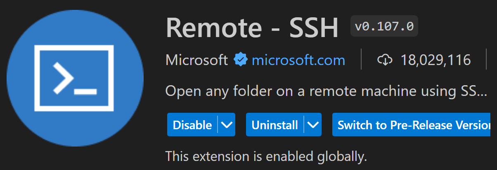
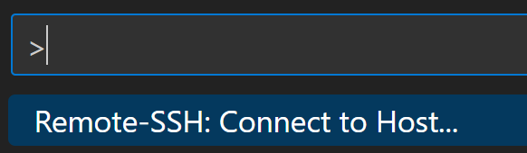

# Using SCITAS to run jobs

<Callout type="note">
  Username and passwords are all your GASPAR login info
</Callout>

## Script

Download the `execute.sh` file from Moodle into your assignment directory

Modify the following

```bash /<username>/ /1G/ /1/3  /<commands>/
#!/bin/bash
#SBATCH --chdir /scratch/<username>
#SBATCH --nodes 1
#SBATCH --ntasks 1
#SBATCH --cpus-per-task 1
#SBATCH --mem 1G

echo STARTING AT `date`

<commands>

echo FINISHED at `date`
```

- Username : your GASPAR username
- CPUs per Task : the number of CPUs used to run each command
- Memory : If you need a larger amount of RAM to execute your script, specify how much memory you need here.
- Commands : You can put here any commands you wish to run on SCITAS, such as `./pi 1 100000000`. They will be executed one after the other.

<Callout type="tip">
You can put `%u` instead of your username so that your script can be used easily by anyone.

Check out the [More Advanced Script](#more-advanced-script) section for more optimizations!

</Callout>

## Setup

Copy all your files into SCITAS:

```bash
scp -r <assignment path> <username>@helvetios.epfl.ch:~/
```

<Callout type="error" contentOnly="true">
<Collapse summary="troubleshoot">
  If you get an error message such as `path canonicalization failed` you can
  try adding the `-O` flag after the `-r`
</Collapse>
</Callout>

SSH into SCITAS:

```bash
ssh <username>@helvetios.epfl.ch
```

Use `ls` & `cd` to navigate into your assignment directory in SCITAS

```bash
make clean

make all
```

Remove files in scratch (if you've already run some SCITAS jobs before and want to delete old output files before continuing)**:**

```bash
rm -r /scratch/<username>/*
```

Copy executables into scratch:

```bash
cp -- !(*.*|Makefile) /scratch/<username>/
```

<Callout type="note">
There are two important directories in SCITAS :

- `/home/<username>` : this is where you are located when you SSH into SCITAS and where you copy your assignment directory
- `/scratch/<username>` : this is where your script is executed and where the output files appear

</Callout>

## Running a Job

Execute job (use `execute-reservation.sh` if needed):

```bash
sbatch execute.sh
```

Check if job is done (if there is a `slurm-<job number>.out` file here):

```bash
ls /scratch/<username>/
```

Check if job is in queue (if your job is stuck in queue - search in list with job number to find it):

```bash
squeue
```

Go into job output (you can write only the first part of the command and tab, it will fill in the number if it's the only job output):

```bash
cat /scratch/<username>/slurm-<job number>.out
```

<Callout type="warning">
  Using this command before your script has finished running will show only a
  partial output. Wait a little longer for the full output to be ready.
</Callout>

To exit the SSH connection to SCITAS:

```bash
exit
```

## Cancelling a Job

Running `sbatch` repeatedly overburdens the workload manager and makes execution and waiting times longer for everyone ! To avoid zombie jobs running in the background, it is important to check for jobs that are stuck in an infinite loop, and to delete them.

To see the list of all queuing and executing jobs, you can use the following :

```bash
squeue --account="cs307" --format="%.7i %.32j %.10u %.10M %T"
```

By default jobs have a time slice of 3 days, so a job that does not terminate will use up ressources needlesly for 72h if we don't intervene! If you see any of your own jobs in the queue above, that has been executing for a large amount of time needlessly, you can cancel it like this :

```bash
scancel <job number>
```

## More Advanced Script

In the default script, you can replace

```bash
#SBATCH --chdir /scratch/<username>
```

with different variants, depending on where you want to place your executables and where you want your output to appear.

The default script uses `--chdir`, which changes your directory to the one specified **before** executing. This means your executables need to be in this specified directory, and your output file will appear there as well.

You can use `--output` instead if you want to keep your executables in the current directory, but have your output file be created somewhere else (this can avoid you having to copy executables to scratch before running).

You can also use various patterns in your directory path, such as `%u` for your username and `%j` for your batch job number.

Here is an example of using all of these together:

```bash
#SBATCH --output /scratch/%u/slurm-%j.out
```

I personally use the following :

```bash
#SBATCH --output ./output/slurm-%j.out
```

This means I don't actually use `scratch` at all : I run my job from my working directory where all my executables are already located, and my output files are created in a directory called `output`, within my current directory.

For more information on `#SBATCH`, see [the Slurm SBATCH documentation](https://slurm.schedmd.com/sbatch.html), or [the filename patterns](https://slurm.schedmd.com/sbatch.html#SECTION_%3CB%3Efilename-pattern%3C/B%3E) in particular for other patterns like `%u` or `%j`.

## SSH with VS Code

VS Code offers an easier way to connect via SSH : once connected you can access all your folders and file through VS Code's file explorer, and you can modify files with the editor (as if you were on your own PC!).

I'm also gonna cover adding an SSH Key to SCITAS, which can make your life easier regardless of wether you want to use VS Code or not.

### Setting up a Remote Host

This means you could simply code your entire assignment in SCITAS ! This is quite useful, especially if you are currently using a Linux VM and then transferring to SCITAS for tests.

To do this, find your .ssh folder on your PC. It is usually at `C:\Users\<username>\.ssh` on Windows or `/home/<username>/.ssh` on Linux.

Then open the config file inside the .ssh folder, if it is already present. Otherwise, create it.

The name of this file should be exactly **config**, with no extension

Open the config file in a text editor and write the following, then save.

```bash
Host <host name>
    HostName helvetios.epfl.ch
    User <username>
```

- Host : any name for this host (for example SCITAS)
- HostName : `helvetios.epfl.ch`
- User : your GASPAR username

You have succesfully created an alias for this remote connection !

With the config file set up, you can also now SSH into SCITAS from any terminal on your host machine using just the host name you have set previously !

You can now write `ssh <host name>` instead of `ssh <username>@helvetios.epfl.ch`

### Connecting through VS Code

The first step is to install the following extension :



Open VS Code and press CTRL+Shift+P or View > Command Palette


In the search bar that appears, search for Remote-SSH: Connect to Host...



A list of all the Hosts in your config file should appear. Select SCITAS in the list. You will be prompted to enter your GASPAR password, and will get connected via SSH to SCITAS.

You can verify you are indeed connected to SCITAS by checking if you have a kind of indication saying `SSH: <host name>` in the bottom left of your VS Code window.

Now that you are connected, when you select Open Folder in VS Code you will be able to navigate through your SCITAS filesystem, and when you open a Terminal in VS Code, it will be a terminal in SCITAS !

### Adding an SSH Key

Currently you have to enter your GASPAR password whenever connecting to SCITAS, whether in the terminal or via VS Code. You can avoid this by using an SSH Key !

If you have never generated an SSH Key on your PC, generate a new one using the following command :

```bash
ssh-keygen -t ed25519 -C "your_email@example.com"
```

Find your public key. It should be located in the same .ssh folder as previously (`C:\Users\<username>\.ssh` on Windows or `/home/<username>/.ssh` on Linux). Open the file called `id_ed25519.pub` in a text editor and copy it's content.

Connect to SCITAS via SSH using a terminal or using VS Code. In your `/home/<username>` folder, create a folder called `.ssh`, and inside this folder create a file called `authorized_keys`. In this file, paste your SSH public key.

You have now added your public key to SCITAS ! You should now be able to connect to SCITAS from your computer without using your GASPAR password.
