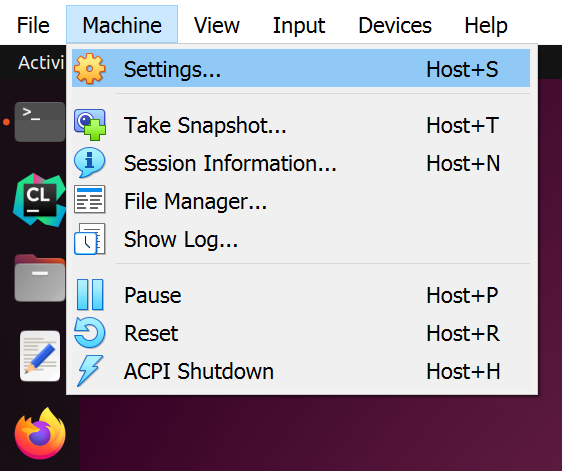
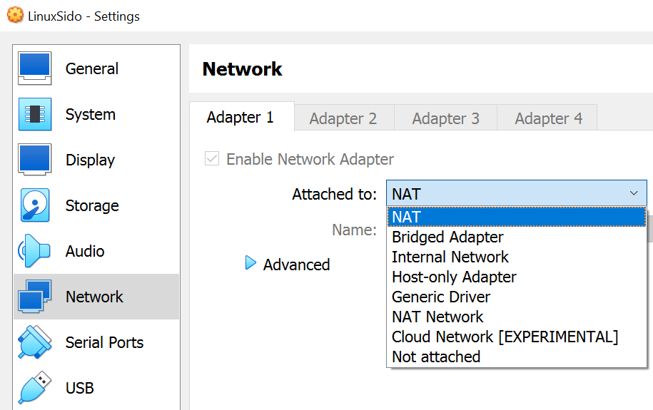
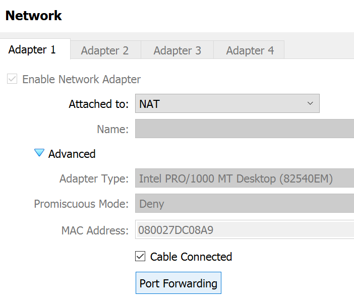
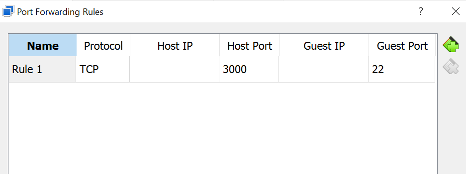
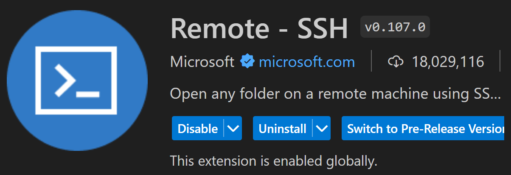
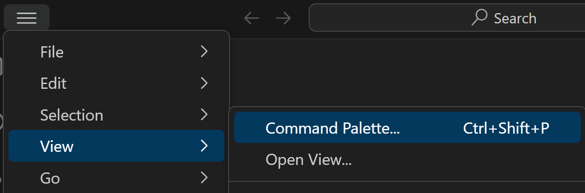
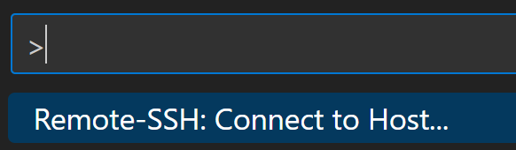
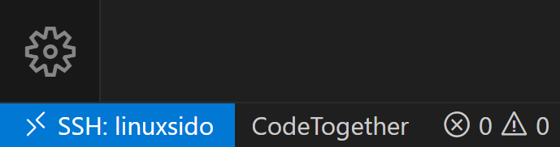
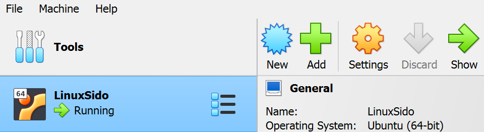

# SSH into VirtualBox VM with VS Code

Open VirtualBox and Start your VM, then open a terminal in your VM and follow the steps below

## Enable SSH on the VM

### Make sure SSH is Running

Check if SSH server is active & running

```bash
systemctl status ssh
```

If not running then enable

```bash
systemctl enable ssh --now
```

If not installed then install SSH

```bash
sudo apt install openssh-server
```

Find port number used (typically 22)

```bash
sudo ss -ntlp | grep -i ssh
    LISTEN 0   128   0.0.0.0:22   0.0.0.0:*   users:(("sshd",pid=787,fd=3))
    LISTEN 0   128      [::]:22      [::]:*   users:(("sshd",pid=787,fd=4))
```

### Firewall

<Callout type="tip">
These steps are only necessary if your VirtualBox VM uses a firewall that is blocking your SSH connection.

Don't hesitate to try out the steps after this section first, and come back here if something isn't working.

</Callout>

Check if SSH is enabled in your firewall using one of the following.
If you find out your firewall is currently inactive,
you can skip these steps entirely: it won't block your SSH connection.

```bash
# Ufw firewall (Ubuntu...)
sudo ufw status

# Firewalld (Red Hat...)
sudo firewall-cmd --state
sudo firewall-cmd --zone=public --list-services

# Ordinary iptables
sudo iptables -L -v
```

If it is not present you can allow it using one of the following

```bash
# Ufw firewall (Ubuntu...)
sudo ufw allow ssh

# Firewalld (Red Hat...)
sudo firewall-cmd --zone=public --add-service=ssh --permanentfirewall-cmd --reload

# Ordinary iptables
sudo iptables -A INPUT -p tcp --dport ssh -j ACCEPT
```

You can also do this using a graphical interface if you have one for your firewall.

<Callout type="warning">
  If your SSH port (as seen previously) is not the usual 22, you may have to
  manually allow the correct port in your firewall as well.
</Callout>

## SSH Settings on the VirtualBox VM

While on your VM, open the machine settings (no need to power it off)



Set your adapter to NAT (if it is not already the case)



Click on Advanced and Port Forwarding



Add a rule and set the port forwarding details



- Name : any
- Protocol : TCP (protocol used by SSH)
- Host IP : empty
- Host Port : any from 0-65535 (preferably above 1023)
- Guest IP : empty
- Guest Port : SSH port number found previously (usually 22)

Refresh network configuration in the VM by turning it off and on

```bash
nmcli networking off
nmcli networking on
```

If nmcli is not installed, you can install it first using

```bash
sudo apt install network-manager
```

Verify your IP Address

```bash /10.0.2.15/24/
ip a
    1: lo:  mtu 65536 qdisc noqueue state UNKNOWN group default qlen 1000
        link/loopback 00:00:00:00:00:00 brd 00:00:00:00:00:00
        inet 127.0.0.1/8 scope host lo
            valid_lft forever preferred_lft forever
        inet6 ::1/128 scope host
            valid_lft forever preferred_lft forever
    2: enp0s3:  mtu 1500 qdisc fq_codel state UP group default qlen 1000
        link/ether 08:00:27:dc:08:a9 brd ff:ff:ff:ff:ff:ff
        inet 10.0.2.15/24 brd 10.0.2.255 scope global dynamic noprefixroute enp0s3
            valid_lft 80381sec preferred_lft 80381sec
        inet6 fe80::dec4:484c:cf97:9f5c/64 scope link noprefixroute
            valid_lft forever preferred_lft forever
    3: docker0:  mtu 1500 qdisc noqueue state DOWN group default
        link/ether 02:42:a8:a1:1c:e0 brd ff:ff:ff:ff:ff:ff
        inet 172.17.0.1/16 brd 172.17.255.255 scope global docker0
            valid_lft forever preferred_lft forever
```

For a NAT network, you will always get `10.0.2.15/24` IP address. our configuration is complete !

Open a terminal in your host machine (outside your VM) to verify the SSH connectivity (you can also do this using PuTTY or similar if you wish)

- Port number : the one you set as Host Port in the VM port forwarding settings
- VM Username : your username on the VM
- VM IP Address : `127.0.0.1` (the loopback IP address)

```bash
ssh -p <port number> <vm username>@127.0.0.1
```

This should prompt you to enter your VM password and then connect you to the VM.

If the above attempt works, you have successfully set up SSH for your VM.
The next section will show you how to connect easily via VS Code rather than the terminal.

## SSH from VS Code

### Updating the SSH config file

First, find your .ssh folder. It is usually at `C:\Users\<username>\.ssh` on Windows or `/home/<username>/.ssh` on Linux.

Then open the **config** file inside the .ssh folder, if it is already present. Otherwise, create it.

<Callout type="warning">
  The name of this file should be exactly **config**, with no extension
</Callout>

Open the config file in a text editor and write the following, then save.

```bash
Host <host name>
    HostName 127.0.0.1
    User <username>
    Port 3000
```

- Host : any name for your VM (you will use this to connect to your VM later)
- HostName : `127.0.0.1` (the loopback IP address)
- User : your VM username
- Port : the one you set as Host Port in the VM port forwarding settings

You have succesfully created an alias for this remote connection !

With the config file set up, you can also now SSH into your VM from any terminal on your host machine using just the host name you have set.

You can now write `ssh <host name>{:bash}` instead of `ssh -p <port number> <vm username>@<vm IP address>{:bash}`

### Connecting through VS Code

The first step is to install the following VS Code extension :



Then, in VS Code, press CTRL+Shift+P or select View > Command Palette



In the search bar that appears, search for Remote-SSH: Connect to Host...



A list of all the Hosts in your config file should appear. Select your VM in the list. You will be prompted to enter your VM password, and will get connected via SSH to your VM.

You can verify you are indeed connected to your VM by checking if you have this indication saying `SSH: <host name>` in the bottom left of your VS Code window.



Now that you are connected, when you select Open Folder in VS Code, you will be able to navigate through your VM filesystem, and when you open a Terminal in VS Code, it will be a terminal of your VM.

<Callout type="note">
Your VM has to be running in order for you to be able to be connected to it via SSH. Any time you wish to connect this way through VS Code, simply open VirtualBox and start your VM, then you can connect to it as long as it remains running.



</Callout>

<Callout type="tip">
  You can select "Headless Start" instead of the regular start in order to start
  your VM without opening it's GUI, if you plan to only use it through VS Code.
</Callout>

### Adding an SSH Key

Currently, you have to enter your VM password whenever connecting to it, whether in the terminal or via VS Code. You can avoid this by using an SSH Key !

If you have never generated an SSH Key on your host PC, generate a new one using the following command :

```bash
ssh-keygen -t ed25519 -C "your_email@example.com"
```

Find your public key. It should be located in the same .ssh folder as previously (`C:\Users\<username>\.ssh` on Windows or `/home/<username>/.ssh` on Linux).
Open the file called `id_ed25519.pub` in a text editor and copy it's content.

Connect to your VM via SSH using VS Code. In the `/home/<username>` folder of your VM, create a folder called `.ssh`, and inside this folder create a file called `authorized_keys`. In this file, paste your SSH public key.

You have now added your public key to your VM ! You should now be able to connect to your VM from your computer without using your password.
